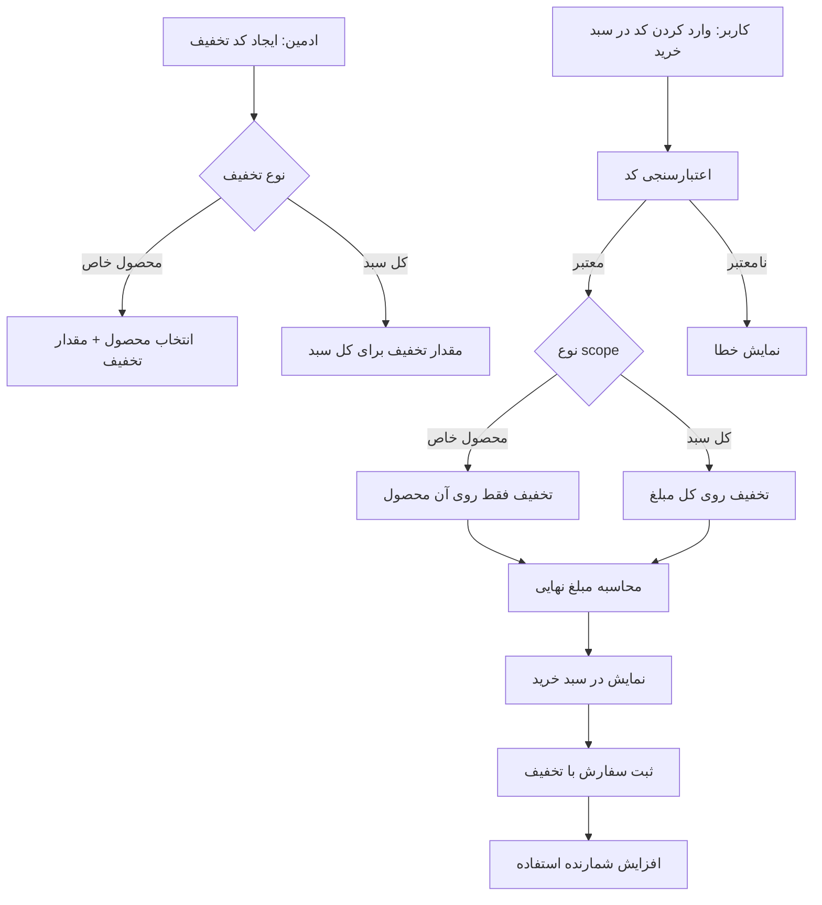
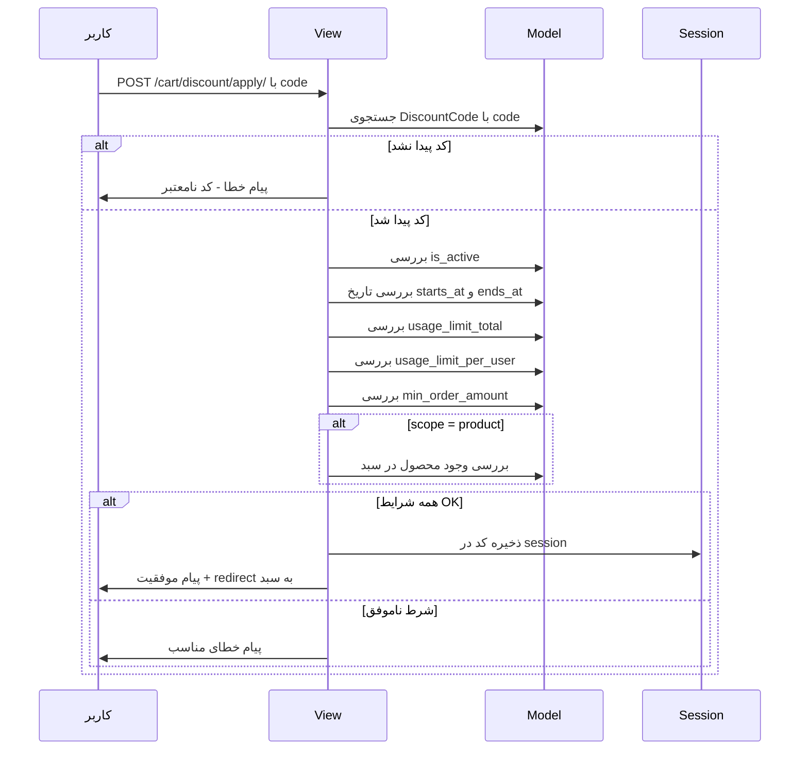
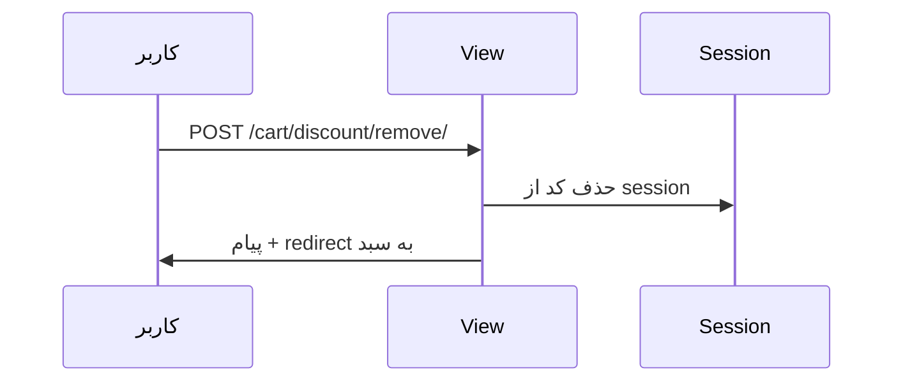
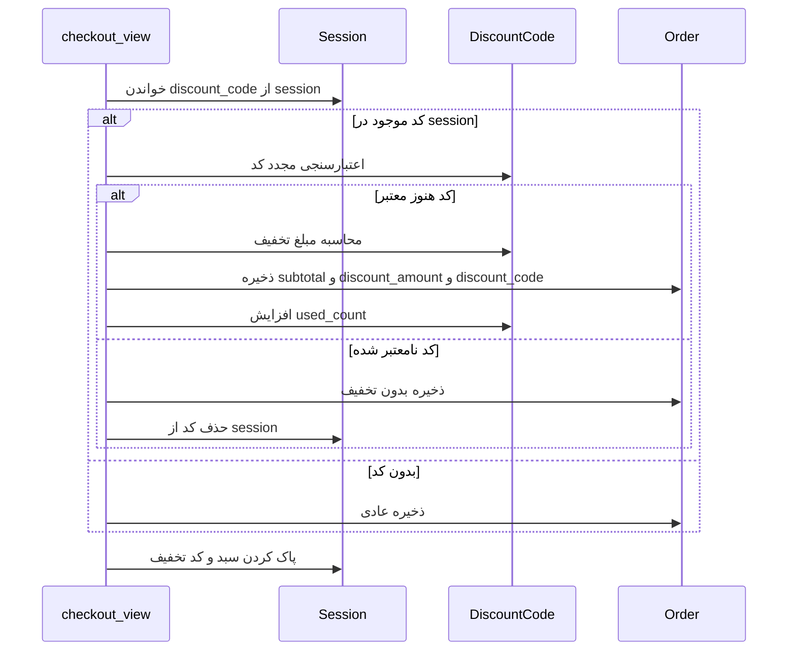

# طرح پیاده‌سازی سیستم کد تخفیف حرفه‌ای

## 📋 خلاصه
پیاده‌سازی سیستم کامل کد تخفیف برای فروشگاه آریو شامل:
- ایجاد و مدیریت کدهای تخفیف از پنل ادمین (فارسی)
- پشتیبانی از تخفیف **مخصوص یک محصول** یا **کل سبد خرید**
- اعمال و حذف کد تخفیف در صفحه سبد خرید
- نمایش آمار استفاده در پنل ادمین

---

## 🏗️ معماری سیستم



---

## 📁 فایل‌های تغییریافته

### 1. `Cart_Module/models.py` — مدل DiscountCode

مدل `DiscountCode` با فیلدهای زیر اضافه می‌شود:

| فیلد | نوع | توضیح |
|------|-----|-------|
| `code` | CharField | کد تخفیف - یکتا، حروف بزرگ |
| `title` | CharField | عنوان تخفیف |
| `description` | TextField | توضیحات |
| `discount_type` | CharField | نوع: درصدی یا مبلغ ثابت |
| `scope` | CharField | **جدید**: محدوده: کل سبد یا محصول خاص |
| `product` | ForeignKey to Product | **جدید**: محصول مرتبط - فقط وقتی scope=product |
| `value` | DecimalField | مقدار تخفیف |
| `max_discount_amount` | DecimalField | سقف تخفیف - برای درصدی |
| `min_order_amount` | DecimalField | حداقل مبلغ سفارش |
| `starts_at` | DateTimeField | تاریخ شروع |
| `ends_at` | DateTimeField | تاریخ پایان |
| `usage_limit_total` | PositiveIntegerField | سقف کل استفاده |
| `usage_limit_per_user` | PositiveIntegerField | سقف استفاده هر کاربر |
| `used_count` | PositiveIntegerField | تعداد استفاده شده |
| `is_active` | BooleanField | فعال/غیرفعال |

فیلدهای جدید روی `Order`:
- `subtotal` — جمع قبل از تخفیف
- `discount_amount` — مبلغ تخفیف
- `discount_code` — FK به DiscountCode

> **نکته**: مایگریشن `0003` قبلاً ایجاد شده ولی فیلدهای `scope` و `product` را ندارد. یک مایگریشن جدید `0004` برای اضافه کردن این دو فیلد ایجاد خواهد شد.

### 2. `Cart_Module/admin.py` — پنل ادمین فارسی

```
DiscountCodeAdmin:
├── fieldsets (فارسی):
│   ├── اطلاعات پایه: code, title, description
│   ├── نوع و مقدار تخفیف: discount_type, scope, product, value, max_discount_amount
│   ├── شرایط استفاده: min_order_amount, starts_at, ends_at
│   ├── محدودیت استفاده: usage_limit_total, usage_limit_per_user
│   └── وضعیت و آمار: is_active, used_count, created_at, updated_at
├── list_display: code, title, discount_type, scope, value, used_count, is_active, ends_at
├── list_filter: is_active, discount_type, scope
├── search_fields: code, title
├── readonly_fields: used_count, created_at, updated_at
└── help_texts: توضیح فارسی برای هر فیلد
```

ویژگی‌های خاص:
- نمایش تعداد استفاده‌کنندگان
- فیلتر بر اساس نوع و وضعیت
- فیلد `product` فقط وقتی `scope=product` نمایش داده شود (با JavaScript در admin)
- help_text فارسی برای هر فیلد

### 3. `Cart_Module/services.py` — سرویس‌های تخفیف

اضافه شدن:
- `DISCOUNT_SESSION_KEY = 'discount_code'`
- توابع کمکی برای اعتبارسنجی و محاسبه تخفیف

### 4. `Cart_Module/views.py` — ویوهای جدید

| ویو | URL | متد | توضیح |
|-----|-----|-----|-------|
| `discount_apply` | `/cart/discount/apply/` | POST | اعمال کد تخفیف |
| `discount_remove` | `/cart/discount/remove/` | POST | حذف کد تخفیف |

تغییرات در ویوهای موجود:
- `cart_detail`: محاسبه تخفیف و ارسال به template
- `checkout_view`: اعتبارسنجی مجدد، ذخیره در Order، افزایش used_count

### 5. `Cart_Module/urls.py` — مسیرهای جدید

```python
path('discount/apply/', views.discount_apply, name='discount_apply'),
path('discount/remove/', views.discount_remove, name='discount_remove'),
```

### 6. `Cart_Module/templates/cart/cart.html` — فرم تخفیف

تغییرات:
- فعال کردن فرم کد تخفیف (حذف disabled)
- اتصال action به `cart:discount_apply`
- نمایش کد فعال با دکمه حذف
- نمایش مبلغ تخفیف در خلاصه سبد
- نمایش نام محصول تخفیف‌خورده اگر scope=product

### 7. `Cart_Module/templates/cart/payment.html` — نمایش تخفیف

- نمایش ردیف تخفیف در خلاصه پرداخت
- نمایش کد تخفیف استفاده شده

### 8. `Cart_Module/templates/cart/invoice.html` — نمایش تخفیف

- نمایش ردیف تخفیف در فاکتور
- نمایش کد تخفیف

---

## 🔄 فلوی اعمال کد تخفیف



---

## 🔄 فلوی حذف کد تخفیف



---

## 🔄 فلوی checkout با تخفیف



---

## 🎨 طراحی UI سبد خرید

### حالت بدون کد تخفیف:
- فرم ورود کد تخفیف فعال با input و دکمه اعمال

### حالت با کد تخفیف فعال:
- نمایش کد فعال با badge سبز
- دکمه حذف کد تخفیف با آیکن ✕
- در خلاصه سبد: ردیف تخفیف با مبلغ منفی
- مبلغ نهایی با احتساب تخفیف

---

## ✅ چک‌لیست پیاده‌سازی

1. اضافه کردن مدل `DiscountCode` به `Cart_Module/models.py` با فیلدهای scope و product
2. اضافه کردن فیلدهای تخفیف به مدل `Order`
3. ایجاد مایگریشن جدید برای فیلدهای scope و product
4. پیاده‌سازی `DiscountCodeAdmin` فارسی با fieldsets و help_texts
5. اضافه کردن `DISCOUNT_SESSION_KEY` و توابع کمکی به services
6. پیاده‌سازی ویوهای `discount_apply` و `discount_remove`
7. به‌روزرسانی `cart_detail` برای محاسبه و نمایش تخفیف
8. به‌روزرسانی `checkout_view` برای اعتبارسنجی و ذخیره تخفیف
9. اضافه کردن URL patterns جدید
10. به‌روزرسانی template سبد خرید
11. به‌روزرسانی template پرداخت
12. به‌روزرسانی template فاکتور
13. اجرای تست‌ها
